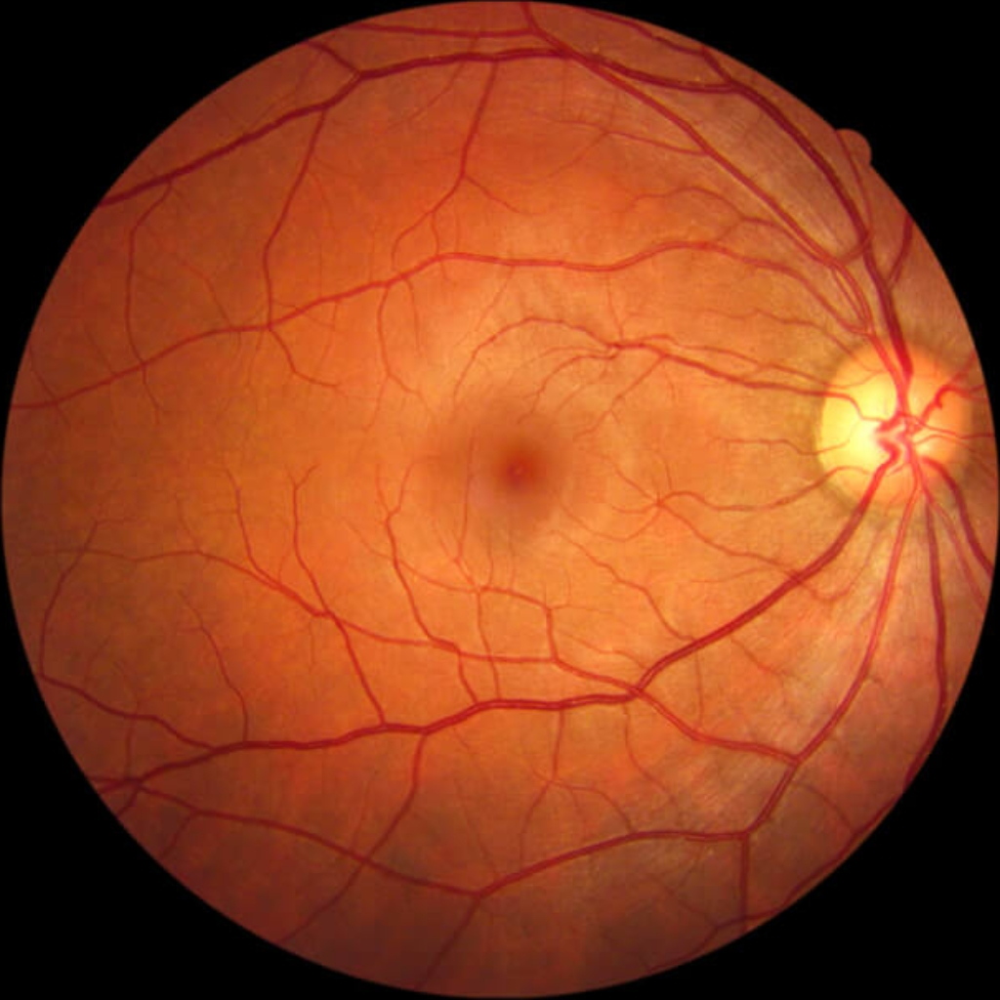
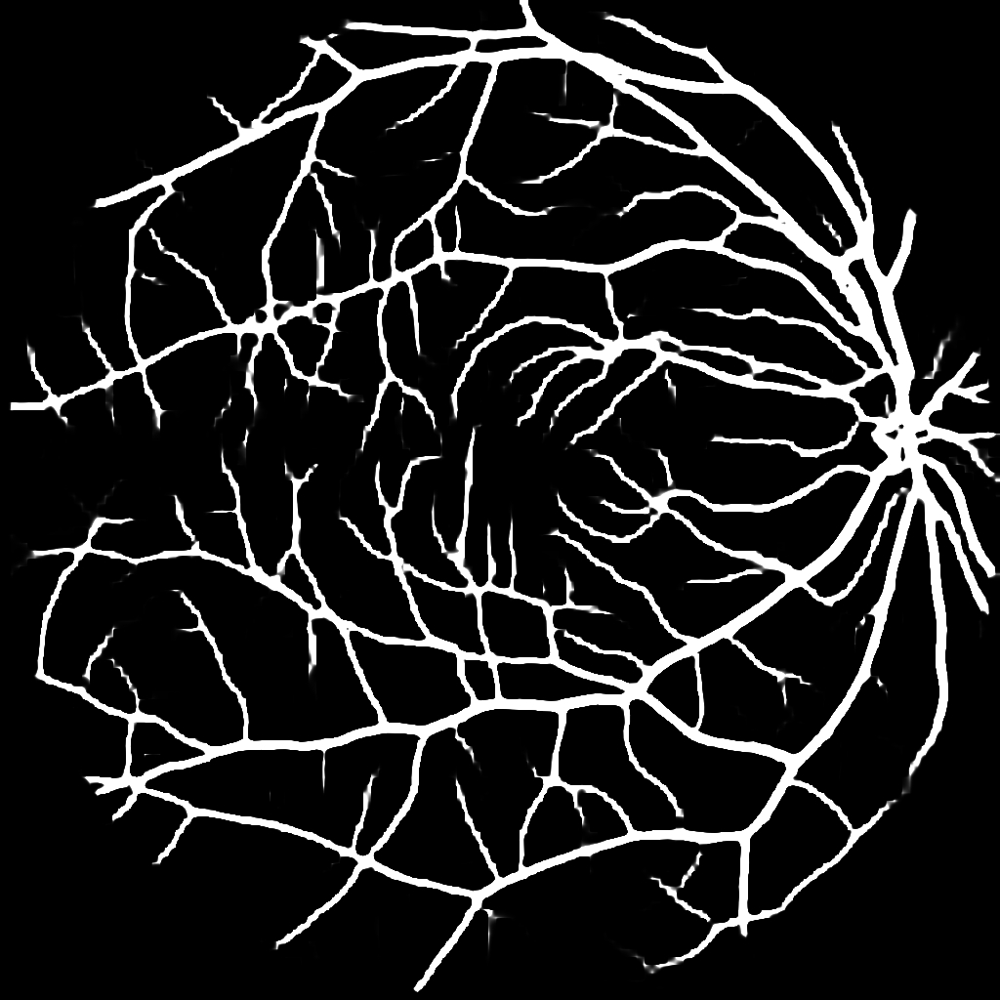
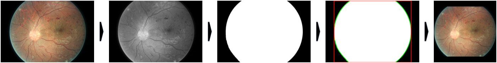

# Domain Agnostic Pipeline for Retina Vessel Segmentation

**This branch trains the model on [FIVES dataset](https://doi.org/10.6084/m9.figshare.19688169.v1).**

<div align="center">

[](https://arxiv.org/abs/2302.09215)
[](http://lazarus.ddns.net:8502)
[]()

|       Fundus Image       |     Predicted Vessel Segmentation     | 
|:------------------------:|:-------------------------------------:|
| | |

</div>

Test image obtained from: [syncedreview.com](https://syncedreview.com/2018/02/20/its-all-in-the-eyes-google-ai-calculates-cardiovascular-risk-from-retinal-images/)

### Retina Image Standardization

<div align="center">



</div>

The captured retina photo is first turned into grayscale, where it is thresholded by 1/3 of the mean pixel intensity to get a preliminary mask. The mask is then cleaned by a median blur filter (ks=25), followed by 2 iterations of erode and 2 iterations of dilate to remove any speckle that may arise from the edges. Finally, the bounding box for the retina can then be inferred by the contour edge of the mask, which can then be padded to square.

### Results

DeepLabV3+ Model trained on DRIVE dataset only (with 5-Fold Cross Validation).

|                   |     Dice      |  Sensitivity  |  Specificity  |      AUC      |
|:------------------|:-------------:|:-------------:|:-------------:|:-------------:|
| FIVES             | 0.840 (0.001) | 0.881 (0.002) | 0.990 (0.000) | 0.977 (0.000) |
| DRIVE (1stHO)     | 0.776 (0.001) | 0.789 (0.015) | 0.975 (0.002) | 0.933 (0.005) | 
| DRIVE (2ndHO)     | 0.791 (0.001) | 0.820 (0.015) | 0.976 (0.002) | 0.946 (0.004) | 
| CHASE_DB1 (1stHO) | 0.786 (0.008) | 0.871 (0.021) | 0.973 (0.002) | 0.966 (0.001) | 
| CHASE_DB1 (2ndHO) | 0.765 (0.006) | 0.868 (0.019) | 0.970 (0.002) | 0.964 (0.002) | 
| STARE (ah)        | 0.774 (0.014) | 0.793 (0.022) | 0.983 (0.001) | 0.952 (0.007) |  
| STARE (vk)        | 0.708 (0.016) | 0.612 (0.202) | 0.990 (0.001) | 0.881 (0.009) | 

`()` denotes Confidence Interval at 95%

### Run Model
```
usage: run_segmentation.py [-h] [-i INPUT_FN] [-o OUTPUT_FN] [-m MODEL_FN] [-v]

Retina Vessel Segmentation

optional arguments:
  -h, --help            show this help message and exit
  -i INPUT_FN, --input_fn INPUT_FN
                        Input Retina Image
  -o OUTPUT_FN, --output_fn OUTPUT_FN
                        Output Segmentation
  -m MODEL_FN, --model_fn MODEL_FN
                        Trained Model
  -v, --verbose         Verbose Output
```

### Requirements

```
Python 3.7.11
```

### Packages:

```
matplotlib==3.5.2
numpy==1.21.6
opencv-contrib-python-headless==4.6.0.66
opencv-python-headless==4.6.0.66
pandas==0.25.2
tensorflow==2.9.1
tensorflow-addons==0.17.1
tqdm==4.36.1
```

### References

```
@article{hou2023vesselseg,
  title={Domain Agnostic Pipeline for Retina Vessel Segmentation},
  author={Hou, Benjamin},
  journal={arXiv},
  year={2023}
}
```
