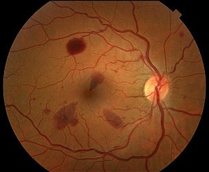
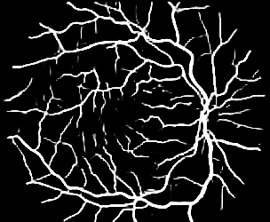

# Retina Vessel Segmentation

TODO

|          Fundus Image          |        Predicted Vessel Segmentation        | 
|:------------------------------:|:-------------------------------------------:|
|  |  |

Test image obtained from: https://www.opsweb.org/page/fundusimaging

### Segmentation Pipeline

TODO

### Results

DeepLabV3+ Model trained on DRIVE dataset only.

|                   |  Dice   | Sensitivity | Specificity |   AUC   |
|:------------------|:-------:|:-----------:|:-----------:|:-------:|
| DRIVE             | 0.76198 |   0.78165   |   0.97600   | 0.95197 |
| CHASE_DB1 (1stHO) | 0.72111 |   0.80264   |   0.97074   | 0.95793 |
| CHASE_DB1 (2ndHO) | 0.71033 |   0.80751   |   0.96838   | 0.96093 |
| STARE (ah)        | 0.73415 |   0.83960   |   0.97117   | 0.96797 | 
| STARE (vk)        | 0.71110 |   0.67829   |   0.98133   | 0.91613 |


### Run Model
```
usage: run_segmentation.py [-h] [-i INPUT_FN] [-o OUTPUT_FN] [-m MODEL_FN] [-v]

Retina Vessel Segmentation

optional arguments:
  -h, --help            show this help message and exit
  -i INPUT_FN, --input_fn INPUT_FN
                        Input Retina Image
  -o OUTPUT_FN, --output_fn OUTPUT_FN
                        Output Segmentation
  -m MODEL_FN, --model_fn MODEL_FN
                        Trained Model
  -v, --verbose         Verbose Output
```

### Requirements

```
Python 3.7.11
```

### Packages:

```
matplotlib==3.5.2
numpy==1.21.6
opencv-contrib-python-headless==4.6.0.66
opencv-python-headless==4.6.0.66
pandas==0.25.2
tensorflow==2.9.1
tensorflow-addons==0.17.1
tqdm==4.36.1
```

### References

```
TODO
```
